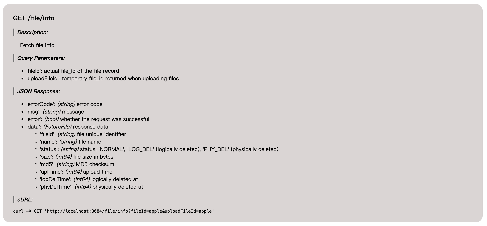

# API Documentation Generation

In non-prod mode (`mode.production: false`), an API documentation is automatically generated and exposed on `/doc/api` endpoint. If `server.port` is 8080, then the generated documentation is accessible through: `http://localhost:8080/doc/api`.

There are two types of documentation generated, one is simply a webpage rendered by browser, another one is the markdown version that can be copied and saved to some README.md files.

miso tries its best to guess all the required parameters from your endpoints, it generates doc about your request/reponse in JSON format, and even creates a demo curl script. But of course, you may provide extra information to describe the endpoints:

```go
miso.RawGet("/file/raw", TempKeyDownloadFileEp).
    Desc(`
        File download using temporary file key. This endpoint is expected to be accessible publicly without
        authorization, since a temporary file_key is generated and used.
    `).
    Public().
    DocQueryParam("key", "temporary file key")

miso.Put("/file", UploadFileEp).
    Desc("Fstore file upload. A temporary file_id is returned, which should be used to exchange the real file_id").
    Resource(ResCodeFstoreUpload).
    DocHeader("filename", "name of the uploaded file")
```

With generics, the generated api doc is actually quite good, the following is a demonstration:

```go
// endpoint
miso.IGet("/file/info", GetFileInfoEp).
    Desc("Fetch file info")

// the request object
type FileInfoReq struct {
	FileId       string `form:"fileId" desc:"actual file_id of the file record"`
	UploadFileId string `form:"uploadFileId" desc:"temporary file_id returned when uploading files"`
}

// the response obejct
type FstoreFile struct {
	FileId     string      `json:"fileId" desc:"file unique identifier"`
	Name       string      `json:"name" desc:"file name"`
	Status     string      `json:"status" desc:"status, 'NORMAL', 'LOG_DEL' (logically deleted), 'PHY_DEL' (physically deleted)"`
	Size       int64       `json:"size" desc:"file size in bytes"`
	Md5        string      `json:"md5" desc:"MD5 checksum"`
	UplTime    miso.ETime  `json:"uplTime" desc:"upload time"`
	LogDelTime *miso.ETime `json:"logDelTime" desc:"logically deleted at"`
	PhyDelTime *miso.ETime `json:"phyDelTime" desc:"physically deleted at"`
}

// handler
func GetFileInfoEp(inb *miso.Inbound, req FileInfoReq) (api.FstoreFile, error) {
    // ...
}
```

The resulting documentation looks like the following:


