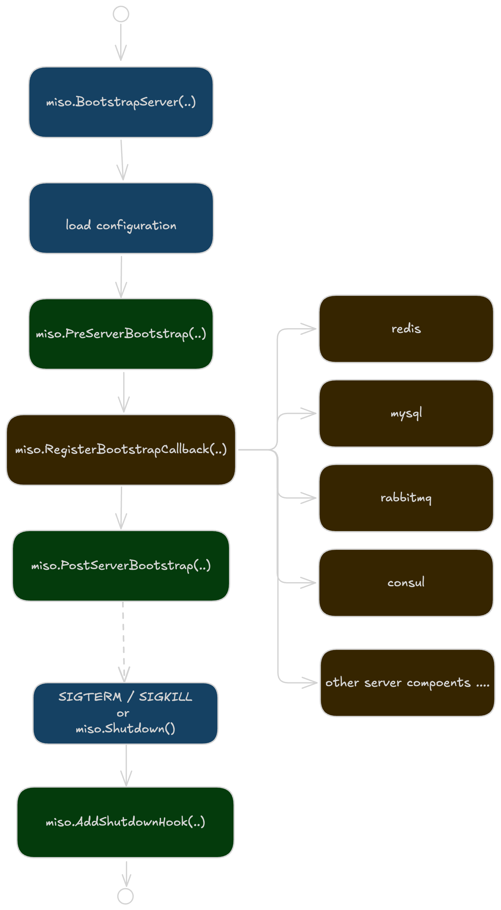

# Application Lifecycle

Miso provides a few lifecycle callbacks. Before any callback is triggered, Miso must load the configuration first.

Callbacks registered by `miso.PreServerBootstrap(...)` are invoked right after Miso loaded configuration from ENV, CLI args and configuration files. From this point, Miso hasn't yet started boostraping.

After all `mios.PreServerBoostrap` callbacks are invoked. Miso then starts boostraping server components by invoking the callbacks registered using `miso.RegisterBootstrapCallback(...)`. The initialization for builtin components like MySQL clients, are just handled exactly the same way like this.

After all `miso.RegisterBootstrapCallback` callbacks are invoked, Miso assumes that the server is fully bootstrapped, it then starts invoking callbacks regsitered using `miso.PostServerBootstrap(...)`.

When miso app receives `SIGTERM` or `SIGKILL`, miso starts the shutdown procedure. You can use `miso.AddShutdownHook(...)` to register callbacks. These hooks are triggered synchronously before the app finally exits. If the shutdown hook takes a long time to finish, increase the graceful shutdown period in configuration and try your best not to block for too long.

